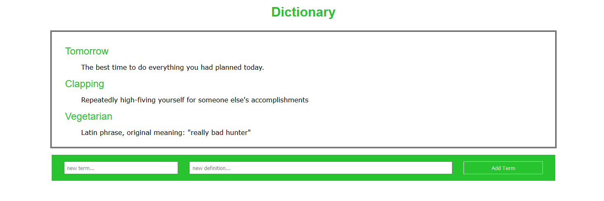

# A Dictionary written using NodeJS.

## Introduction

This is an small dictionary application. Features include add, remove, update terms. The purpose is to learn REST API.

## Installation and deploy
```sh
git clone https://github.com/DatNgo1995/dictionary.git
npm install
node app.js

```

Application runs at http://localhost:3000/